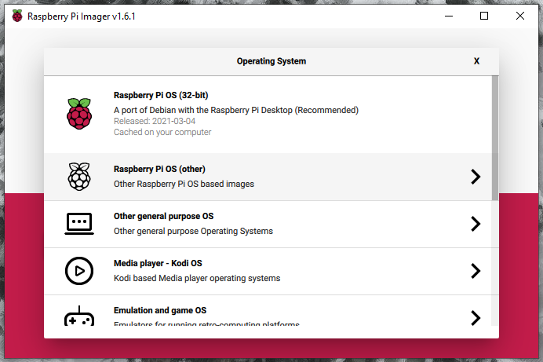
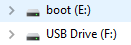
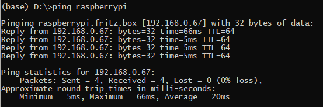
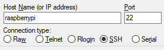
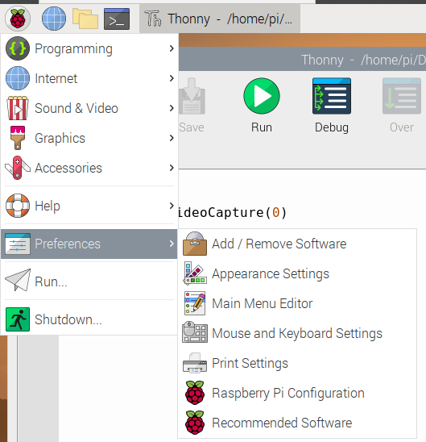

# Create SD Image
* Insert microSD card in PC.
* Run [Raspberry Pi Imager](https://www.raspberrypi.org/documentation/installation/installing-images/)
* Select "Raspberry Pi OS (32-bit)"



* Remove SD card and reinsert

## Outcome
This produces an SD card installed with Raspbian.  The SD card has a number of "drives" on it.
* The "boot" drive contains the operating system.
* The other drive is additional space on the SD card that the system can later use.



# Create WiFi Files
* Create two files on the boot drive
	* ``ssh`` - this is a file called ``ssh`` with no content.  It's presence on the the disk will enable ssh on the first boot.
	* ``wpa_supplicant.conf`` - this file connects

	```
	ctrl_interface=DIR=/var/run/wpa_supplicant GROUP=netdev
	update_config=1
	country=GB

	network={
	 ssid="SSID"
	 psk="PASSWORD"
	}
	```
* Eject the SD card

# Boot the Pi
* Insert the SD card in the Pi.
* Power Pi

# Find IP address
* From a command prompt ``ping raspberrypi``
* Note the IP address (in this case 192.168.0.67)


# Install and Run Putty
* Download and install [PuTTY](https://www.chiark.greenend.org.uk/~sgtatham/putty/)
* Run PuTTY
* Open an SSH connection to the Pi.  (``Yes`` to the Security Alert)

* ```login as: pi```
* ```pi@raspberrypi's password: raspberry```

# Enable SSH
The ``ssh`` file will be deleted when the Pi boots up.  SSH will only be enabled for the first boot.
Type the following to permanently enable it.
```
sudo systemctl enable ssh
sudo systemctl start ssh
```

# Install RDP
```
sudo apt-get install xrdp
```

# Update Linux
```
sudo apt-get update
sudo apt-get upgrade
```

# Install OpenCV
```
pip3 install --upgrade pip
pip3 install opencv-python

sudo apt-get install libatlas3-base
```

MAY NEED
```
sudo apt-get install libhdf5-dev libhdf5-serial-dev libhdf5-100
sudo apt-get install libqtgui4 libqtwebkit4 libqt4-test python3-pyqt5
sudo apt-get install libatlas-base-dev
sudo apt-get install libjasper-dev
```

# Connect Remote Desktop
Run "Remote Desktop Connection" from the Start menu. Username: pi, Password: raspberry

# Enable Camera
On Pi application menu, select Prefences: Raspberry Pi Configuration.
Under "Interfaces", Enable Camera.  This will require a reboot.


# Motor Libraries
```
sudo pip3 install adafruit-circuitpython-motorkit
```

# NeoPixel Libraries
```
sudo pip3 install rpi_ws281x adafruit-circuitpython-neopixel
sudo python3 -m pip install --force-reinstall adafruit-blinka
```
